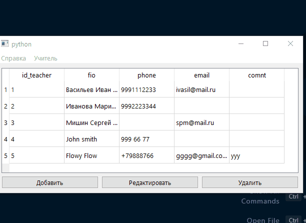
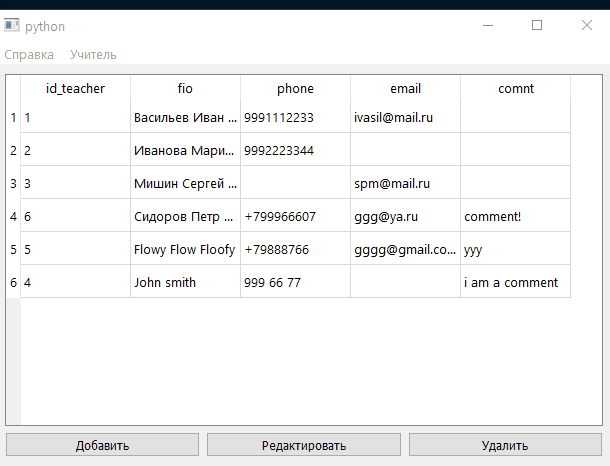
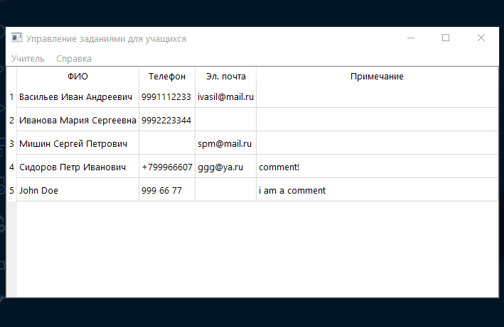

# PyQt5 + PostreSQl Учебный проект

Этот проект представляет собой приложение на PyQt5, которое позволяет работать с базой данных учителей, их заданий и учеников в PostgreSQL. Оно предоставляет функционал для отображения, добавления, редактирования и удаления данных об учителях (на данном этапе).

## Функциональность
***
- **Отображение данных**: При запуске приложения отображается таблица с данными учителей, включая их ФИО, телефон, email и примечания.
- **Добавление нового учителя**: В приложении есть возможность добавлять нового учителя в базу данных через диалоговое окно. Для этого необходимо ввести ФИО, телефон, email и примечание.
- **Редактирование информации об учителе**: Вы можете выбрать учителя из таблицы, отредактировать его данные через диалоговое окно и сохранить изменения.
- **Удаление учителя**: Реализована возможность удаления записи о учителе.

## Демонстрация работы приложения
***
**Добавление учителя**


**Редактирование данных**



**Удаление учителя**



## Технологии
***
- **PyQt5**: используется для создания графического интерфейса.
- **PostgreSQL**: база данных для хранения информации об учителях.
- **QSqlQueryModel**: используется для работы с базой данных через модель представления данных в таблице.

## Установка
***
1. Клонируйте репозиторий:

   ```bash
   
   git clone https://github.com/AnastasiiaXX/PyQt-db-project.git
   
    ```
2. Создайте виртуальное окружение и установите необходимые библиотеки (из requirements.txt):

   ```bash
   python -m venv venv
   ```
3. Для активации виртуального окружения:

    Для Linux/Mac:
    ```bash
    source venv/bin/activate
    ```
  
    Для Windows:

    ```bash
    .\venv\Scripts\activate
    ```
4. Настройка подключения к базе данных PostgreSQL

    В файле `settings.py` нужно настроить следующие параметры подключения:

- `host` — адрес хоста базы данных.
- `port` — порт базы данных.
- `dbname` — имя базы данных.
- `user` — имя пользователя.
- `password` — пароль пользователя.

5. Запуск приложения

    После того как все зависимости будут установлены 
и подключение к базе данных настроено, запустите приложение:

    ```bash
    python __main__.py
    ```